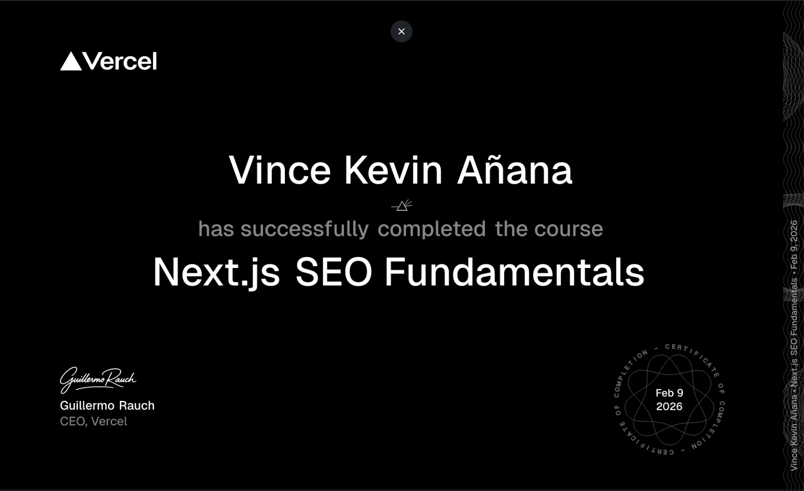
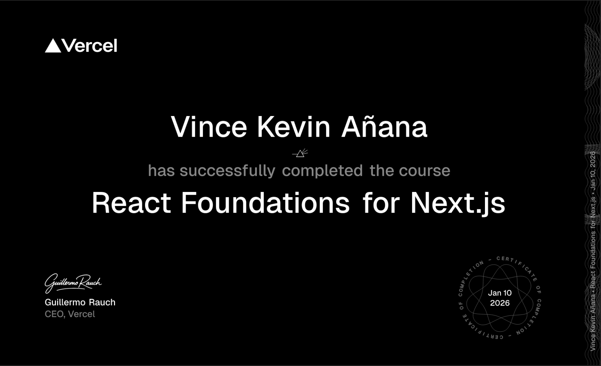

  <div align="center">

  ## UI/UX Designer • Web Developer • Digital Operations Manager

  

  [](https://vka-portfolio.vercel.app)
  [](https://vka-portfolio.vercel.app/resume)
  [](mailto:vinceanana45@gmail.com)

  </div>

  ---

  ## About Me

  - Currently working as **Web Developer** at **FutureThink Hub** (Non-Profit)
  - Also serving as **Digital Operations Manager** at **La Chow**
  - Specializing in **Next.js**, **React**, **TypeScript**, and **SEO**
  - Passionate about creating beautiful, responsive, and user-friendly interfaces
  - Based in **Cebu, Philippines** - Open to remote opportunities
  - Earned **5 professional certifications** in 2026 (SEO, Next.js, React)

  ---

  ## Tech Stack

  ### Languages
  
  
  
  

  ### Frontend
  
  
  
  
  

  ### Backend & Database
  
  
  
  

  ### Design & Tools
  
  
  

  ### Marketing & Analytics
  
  
  

  ---

  ## GitHub Stats

  <div align="center">

  [](https://github.com/mantequilla45)

  </div>

  ---

  ## Featured Projects

  ### [La Chow](https://www.thelachow.com)
  Rebuilt company website from scratch with Next.js, boosting traffic through advanced SEO and integrated CRM.
  - **Tech:** Next.js, GoHighLevel, Google Analytics
  - **Impact:** Significantly increased site traffic and streamlined booking workflows

  ### [Guided Edge](https://www.futurethinkedge.org)
  Large-scale educational platform where I serve as Lead Web Developer and Software Engineer.
  - **Tech:** Next.js, Python
  - **Role:** Architected scalable codebase, designed UI, engineered front-end foundation

  ### [BSDOC](https://bsdoc-project.vercel.app/)
  Comprehensive web-based symptom checker and health guide with personalized recommendations.
  - **Tech:** Next.js, Firebase
  - **Features:** Symptom checker, medication recommendations, secure data storage

  ### [PC BuildIt](https://github.com/mantequilla45/PC-Building-Simulator)
  Desktop application for designing custom PCs with compatibility checking and cost calculation.
  - **Tech:** C#, Windows Forms, .NET
  - **Features:** Component compatibility, cost calculation, clean UI

  **[View All 10 Projects →](https://vka-portfolio.vercel.app)**

  ---

  ## Certifications

  <div align="center">

  
  
  
  
  

  </div>

  **Certifications:**
  - **[SEO Certification](https://app-na2.hubspot.com/academy/achievements/434d3phz/en/1/vince-kevin-anana/seo)** - HubSpot Academy (2026)
  - **[React Foundations](https://nextjs.org/learn/certificate?course=react-foundations&user=137115&certId=react-foundations-137115-1770478746126)** - Next.js Learn (2026)
  - **[Next.js Pages Router](https://nextjs.org/learn/certificate?course=pages-router&user=137115&certId=pages-router-137115-1770478725017)** - Next.js Learn (2026)
  - **[Next.js App Router](https://nextjs.org/learn/certificate?course=dashboard-app&user=137115&certId=dashboard-app-137115-1770476406945)** - Next.js Learn (2026)
  - **[SEO Fundamentals](https://nextjs.org/learn/certificate?course=seo&user=137115&certId=seo-137115-1770618305781)** - Next.js Learn (2026)

  ---

  ## What I'm Working On

  ```javascript
  const vinceKevin = {
    currentRole: ["Web Developer", "Digital Operations Manager"],
    currentlyLearning: ["Advanced Next.js Patterns", "Performance Optimization"],
    recentProjects: ["Guided Edge Platform", "La Chow Website", "FutureThink Hub"],
    hobbies: ["UI/UX Design", "Building Web Apps", "SEO Optimization"],
    availableFor: ["Freelance Projects", "Remote Opportunities", "Collaborations"]
  };
  ```

  ---

  ## Connect With Me

  <div align="center">

  [](https://vka-portfolio.vercel.app)
  [](mailto:vinceanana45@gmail.com)
  [](tel:+639959308404)

  </div>

  ---

  <div align="center">

  **"Building digital experiences, one line of code at a time."**

  

  </div>
