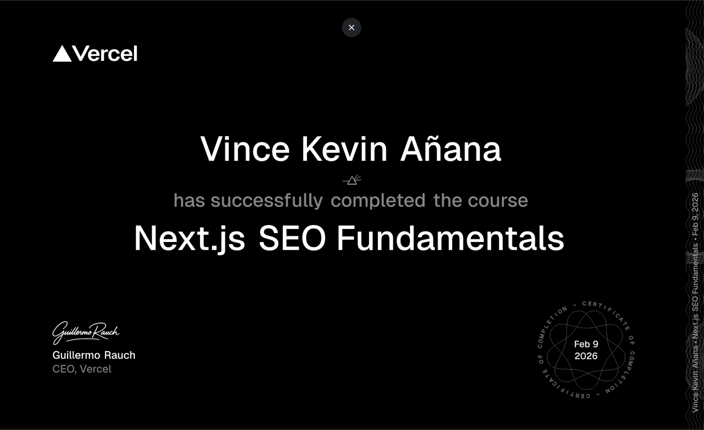
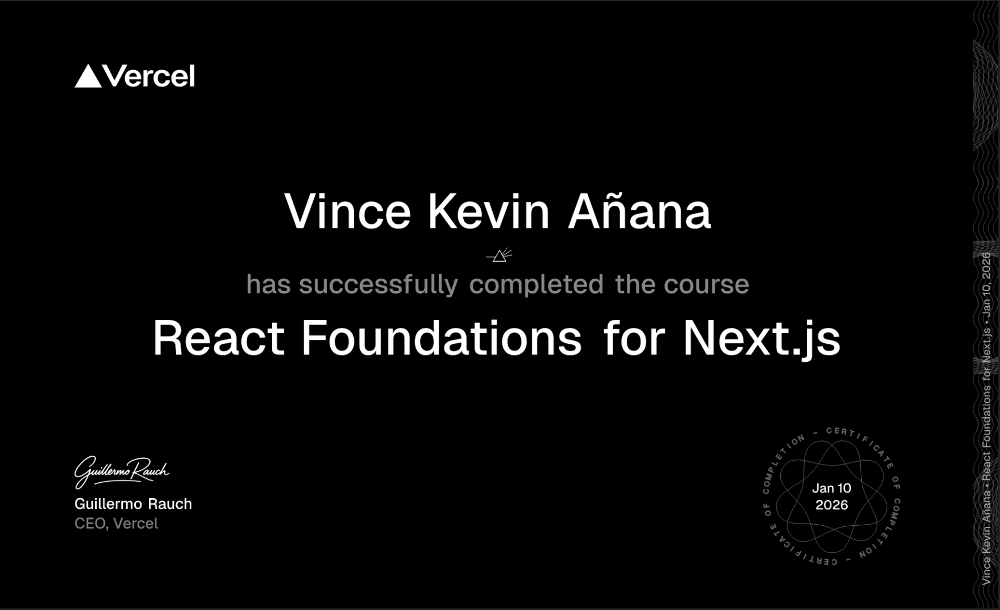
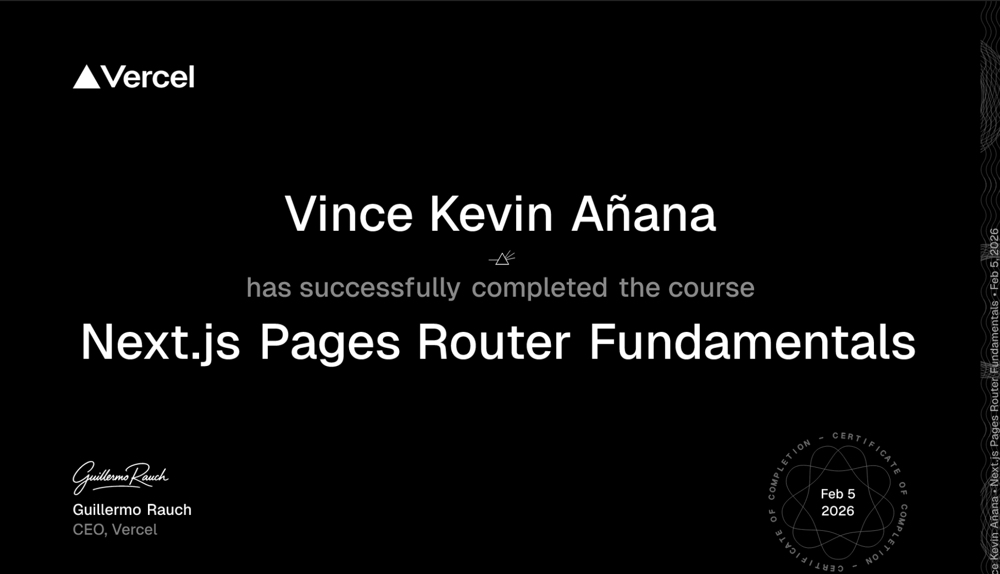
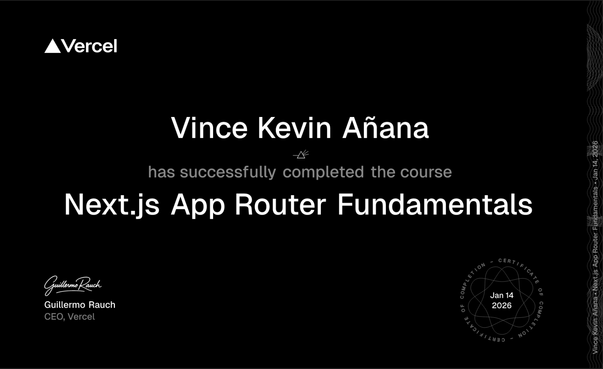

<div align="center">

## Full-Stack Software Engineer


[](https://vka-portfolio.vercel.app)
[](https://vka-portfolio.vercel.app/resume)
[](mailto:vinceanana45@gmail.com)

</div>

---

## About Me

- Full-stack developer building AI-powered platforms, SaaS products, and marketplaces from scratch
- Currently contracted at **Light Logic Pte Ltd** (Singapore), **Lesson Lift** (London), and **WorkWhale** (London)
- Shipped **30+ streaming AI tools** using the Anthropic Claude API with real-time markdown output
- Proficient in **Next.js**, **React**, **TypeScript**, **Supabase**, and **Claude API**
- Based in **Cebu, Philippines** — open to remote opportunities

---

## Tech Stack

### Languages


### Frontend


### Backend & Database


### AI & Integrations


### Deployment


### Design & Tools


---

## GitHub Stats

<div align="center">

[](https://github.com/mantequilla45)

</div>

---

## Featured Projects

### [Work Whale](https://workwhale.ph)
Remote job marketplace platform connecting employers with skilled workers. Built from scratch.
- **Tech:** Next.js, Supabase, Stripe, SendGrid, Sentry
- **Features:** Role-based dashboards, job moderation, application tracking, email system

### [La Chow OS](https://portal.thelachow.com)
Fully custom tenant management platform, comparable to DoorLoop but built specifically for La Chow.
- **Tech:** Next.js, NestJS, Supabase, GoHighLevel CRM
- **Features:** Role-based access control, lease management, billing, payment tracking

### [La Chow](https://www.thelachow.com)
Rebuilt company website from scratch with Next.js, boosting traffic through advanced SEO and CRM integration.
- **Tech:** Next.js, GoHighLevel, Google Analytics
- **Impact:** Significantly increased organic traffic and streamlined booking workflows

### [Lesson Lift](https://lessonlift.com)
AI-powered teaching toolkit for UK educators with 30+ tools that generate professional documents in seconds.
- **Tech:** Next.js, React, TypeScript, Anthropic Claude API, Tiptap
- **Features:** Real-time streaming, PDF/DOCX export, lesson plans, reports, policies, and more

### [PC BuildIt](https://github.com/mantequilla45/PC-Building-Simulator)
Desktop application for designing custom PCs with compatibility checking and cost calculation.
- **Tech:** C#, Windows Forms, .NET
- **Features:** Component compatibility, cost calculation, clean UI

**[View All Projects →](https://vka-portfolio.vercel.app)**

---

## Certifications

<div align="center">







</div>

- **[SEO Certification](https://app-na2.hubspot.com/academy/achievements/434d3phz/en/1/vince-kevin-anana/seo)** - HubSpot Academy (2026)
- **[React Foundations](https://nextjs.org/learn/certificate?course=react-foundations&user=137115&certId=react-foundations-137115-1770478746126)** - Next.js Learn (2026)
- **[Next.js Pages Router](https://nextjs.org/learn/certificate?course=pages-router&user=137115&certId=pages-router-137115-1770478725017)** - Next.js Learn (2026)
- **[Next.js App Router](https://nextjs.org/learn/certificate?course=dashboard-app&user=137115&certId=dashboard-app-137115-1770476406945)** - Next.js Learn (2026)
- **[SEO Fundamentals](https://nextjs.org/learn/certificate?course=seo&user=137115&certId=seo-137115-1770618305781)** - Next.js Learn (2026)

---

## What I'm Working On

```javascript
const vinceKevin = {
  currentRoles: ["Light Logic Pte Ltd", "Lesson Lift", "WorkWhale"],
  currentlyBuilding: ["AI-powered lighting design platform", "AI teaching toolkit for UK educators", "Remote job marketplace"],
  techFocus: ["Anthropic Claude API", "Real-time streaming", "Next.js", "Supabase"],
  availableFor: ["Freelance Projects", "Remote Opportunities", "Collaborations"]
};
```

---

## Connect With Me

<div align="center">

[](https://vka-portfolio.vercel.app)
[](mailto:vinceanana45@gmail.com)

</div>

---

<div align="center">

**"Building digital experiences, one line of code at a time."**


</div>
